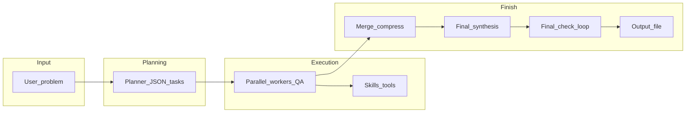

# Agent Hive

**Agent Hive turns one prompt into a managed, QA-checked, multi-step LLM workflow.**

It is an experimental, local-first orchestration runner for people who want to use LLMs for tasks that are too structured, too evidence-sensitive, or too long-running for a single chat prompt.

Instead of asking one model to plan, research, execute, verify, and summarize everything in one response, Agent Hive breaks the problem into a dependency-aware task graph, runs workers, checks their outputs, optionally uses local tools or skills, merges the results, and performs a final consistency review.

It works with any **OpenAI-compatible HTTP API**, including LM Studio, vLLM, Ollama compatibility mode, OpenAI, and similar providers.

Agent Hive is useful for:

- research reports that need sources, caveats, and claim tracking
- technical comparisons such as vendor/pricing evaluations
- proposal or long-form writing grounded in a local knowledge base
- software/design tasks that benefit from planning, QA, and replanning
- local/small-model workflows where structure helps compensate for weak long-context behavior
- tool-heavy runs where workers create or reuse files in a workspace

Agent Hive is **not** a general-purpose LLM application framework like LangChain/LangGraph, and it is not a no-code automation platform like n8n, Dify, or Flowise. It is more opinionated: a workflow harness for running structured LLM jobs with planning, QA, evidence handling, replanning, and reproducible sample configurations.

## What it does

Given a user problem, Agent Hive can:

- generate a JSON task plan with dependencies
- run independent worker tasks in parallel
- apply per-task QA and retry failed work
- reuse previous tool traces during retries
- split difficult failed tasks into micro-steps
- invoke file-based skills, including OpenClaw-style skill folders
- read from an optional local knowledge-base directory
- build assertion ledgers with claims, evidence, caveats, numeric values, and verified/unverified buckets
- enforce evidence policies such as `strict_research`, `pricing_strict`, and `academic_strict`
- preserve mandatory deliverables across replans
- checkpoint milestone tasks and replan remaining work
- carry forward knowledge after a failed final check
- optionally reuse a shared workspace across replans
- merge and compress large intermediate outputs
- produce a final answer and save artifacts to disk
- run from CLI or a small web UI with per-run model selection

It does **not** guarantee correctness. The goal is to make complex LLM work more inspectable, recoverable, and evidence-aware — not to remove the need for human review.

Configuration is driven by **environment variables** (typically via a `.env` file). Copy [`.env.example`](.env.example) to `.env` and edit values there; defaults are defined in [`hive_env.py`](hive_env.py).

---

## Install

```bash
git clone https://github.com/GabriellaAH/Agent-Hive.git
cd Agent-Hive

python -m venv .venv
source .venv/bin/activate
```

Windows PowerShell:
```bash
.\.venv\Scripts\Activate.ps1

```

Install dependencies:
```bash
pip install -r requirements.txt
cp .env.example .env
```

For a local LM Studio setup, set:
```env
HIVE_BASE_URL=http://127.0.0.1:1234
HIVE_API_KEY=lm-studio
```

For OpenAI, set:
```env
OPENAI_API_KEY=your_key_here
```

Then run a smoke test:
```bash
python test.py
```

---

## How to run

| Mode | Command |
|------|---------|
| **CLI** (one-shot) | `python agent_hive.py "Your problem text here"` |
| **CLI** (stdin) | `python agent_hive.py` then paste text and EOF (Ctrl+Z Enter on Windows, Ctrl+D on Unix) |
| **Web UI** | `python agent_hive.py --web` — bind host/port from `HIVE_WEB_HOST` / `HIVE_WEB_PORT`, overridable with `--host` / `--port`. On load, the UI calls `GET /api/llm-options` to list models from **LM Studio** (`HIVE_BASE_URL` / `HIVE_API_KEY`) and, when configured, from **OpenAI** (`OPENAI_API_KEY`); the same response includes `kb_dir_default` from `HIVE_KB_DIR` to pre-fill the optional knowledge base path. Under **New run**, pick provider (OpenAI is grayed out without a key) and model; each run sends `llm_provider`, `model`, and optional `kb_dir` to the server and overrides `HiveConfig` for that run only. |
| **Connectivity smoke test** | `python test.py` — lists models and streams one prompt (`HIVE_TEST_PROMPT` or default) |

Skills are discovered under `HIVE_SKILLS_DIR` (default `./skills`); enable/disable ids in `HIVE_SKILLS_ENABLED_FILE` (default `./hive_skills_enabled.json`) or via the web API.

You can grow that directory with additional **OpenClaw**-style skill bundles from the community catalog **[ClawHub](https://clawhub.ai/)** (search, install, then drop compatible packs under your skills root so each skill has its own folder with `SKILL.md` as [`skills_registry.py`](skills_registry.py) expects—same enablement flow as built-in skills).

---

## Project status

Agent Hive is an experimental open-source project and is not production-ready.

It is suitable for:
- local experiments
- research/workflow prototypes
- testing multi-agent orchestration patterns
- learning how QA-gated LLM workflows behave

Use caution for:
- production automation
- untrusted tools or skills
- high-stakes factual, financial, legal, or medical decisions
- unattended long-running workflows

---

## Try a sample

The `SAMPLES/` directory contains reproducible scenarios with tuned `.env.sample` files.

Good first runs:

- `01_local_lm_minimal` — minimal local LM Studio-style run
- `04_pricing_ledger_strict` — strict pricing/evidence workflow
- `09_mandatory_deliverables` — force required sections in the final answer
- `13_outer_replan_carryover_large_digest` — advanced outer replan carryover
- `14_outer_replan_shared_workspace` — advanced shared workspace reuse

Each sample includes its own `README.md` with the test prompt, settings, and run command.

---

## Core logic (pipeline)



1. **Planner** — The model emits a JSON plan: ordered tasks with `id`, `title`, `description`, `acceptance_criteria`, `depends_on`, optional `key_task`, and optional top-level `required_deliverables` (merged with `HIVE_REQUIRED_DELIVERABLES` for every planner/repair/critique call, including after final-check **replan**). Validation and optional critique/repair rounds enforce schema and quality.
2. **Scheduler** — Tasks respect dependencies; independent tasks run on a pool of worker slots (`HIVE_MAX_PARALLEL_WORKERS`, capped by `HIVE_MAX_PARALLEL_WORKERS_CAP`).
3. **Per-task worker** — For each task: optional **skill router**, then **worker** with optional **tool rounds**, then **QA** in JSON.
   - **QA retry + tool trace** — When `HIVE_QA_RETRY_TOOL_TRACE` is true (default), after a QA failure the next worker prompt includes a **transcript** of the previous attempt’s tool calls and raw tool outputs (capped by `HIVE_QA_RETRY_TOOL_TRACE_MAX_CHARS`), plus instructions to fix format or structure from that evidence without blindly repeating the same `http_fetch` / `run_script` unless QA says facts are wrong or missing. If the planner **refines** the task spec after many QA failures, the stored transcript is cleared so it does not contradict the new acceptance criteria.
   - **QA fail decompose** — When `HIVE_QA_FAIL_DECOMPOSE_ENABLED` is true, after a QA failure (from attempt index `HIVE_QA_FAIL_DECOMPOSE_MIN_ATTEMPT` onward, once per task) an extra LLM pass decides whether **one more** normal worker shot is enough (`single_shot_ok`) or the work should be split into **ordered micro-steps** (at most `HIVE_QA_FAIL_DECOMPOSE_MAX_STEPS`). If a micro-plan is emitted, the next loop iteration runs that **sequence of workers** (reusing the last skill-router selection), concatenates their outputs as the candidate solution, then runs the usual **parent-task QA** again—without adding new planner task ids.
   - If `HIVE_POST_QA_ASSERTION_LEDGER` is true, after QA passes a **strict claims ledger** LLM step emits JSON (`claims`, `unverified_claims`, `contradictions`) with typed evidence (`source_url`, `source_type`, `quote_or_snippet`, `retrieved_at`), optional `numeric_values`, and optional `formula` for estimate-style quantitative claims. Python validation splits **verified** vs **unverified** (`HIVE_EVIDENCE_POLICY` presets such as `pricing_strict` / `strict_research` / `academic_strict`, allowlist override via `HIVE_LEDGER_ALLOWED_SOURCE_TYPES` when non-empty, pricing rules, quantity-text heuristics, optional `HIVE_PRICING_REQUIRES_URL`). When `HIVE_LEDGER_CONFLICT_RESOLUTION` is true (default), the orchestrator **deterministically** resolves cross-task clashes on the same provider + metric + unit (prefer official sources, then newer `retrieved_at`) and may add resolution notes for the merger. **Merge** / **final synthesis** consume the formatted ledger; `results` still holds the full solution for downstream workers and checkpoints. With `HIVE_RESEARCH_VERIFIED_ONLY_FINAL`, only verified claims may be stated as facts in the main narrative, and final synthesis receives an **excluded digest** so the model can write a `## Not verified / excluded` section. A **claims run report** (task id, worker slot, per-claim evidence) is written to `hive_claims_*.json` when configured / when ledger rows exist, and a truncated copy may appear in the web `/api/status` snapshot.
4. **Checkpoints** — `key_task` tasks can trigger a **checkpoint** model that may `continue`, `finish_early`, or `replan` remaining work.
5. **Merge** — Completed task outputs are merged (single-pass or hierarchical compression if inputs exceed `HIVE_MERGER_INPUT_THRESHOLD_CHARS`). When the assertion ledger is enabled and built for a task, that task’s merge input is the ledger text instead of the full worker output (integration QA on the critical path still uses full outputs).
6. **Final synthesis** — Optional pass to produce a single user-facing answer from the merged draft (same ledger-aware input note as merge when any ledger was used).
7. **Final check** — A consistency reviewer may `pass`, request fixes, or force a **replan** of the whole run within configured attempt budgets. If mandatory deliverables are configured, a deterministic coverage hint is appended when phrases may be missing from the candidate.
   - **Replan carryover** — When `HIVE_REPLAN_CARRYOVER_ENABLED` is true (default), each outer replan writes `attempt_<n>.md`/`.json` plus `LATEST.md` under `HIVE_OUTPUT_DIR/run_carryover/<session_id>/knowledge/` (session id is logged once per `run_hive` call). The next cycle reads `LATEST.md`, clamps it to `HIVE_REPLAN_KNOWLEDGE_MAX_CHARS`, and appends it to the planner problem and to worker/skill-router/micro-step prompts as `[Prior run knowledge base]`, alongside the existing final-check verdict block in `user_prompt`. With `HIVE_REPLAN_SHARE_WORKSPACE=true`, every outer cycle reuses the same run-scoped workspace folder under that session so files created by `run_workspace_python` (e.g. downloaded papers) remain available after replan.
   - **User knowledge base** — When `HIVE_KB_DIR` is set (or the web UI **Knowledge base directory** field sends a non-empty `kb_dir` per run), the orchestrator builds a capped text index from allowed extensions under that folder and injects it into the planner and worker/skill-router/micro-step prompts as `[User knowledge base]`. Workers may call host tools `kb_list` and `kb_read` to list or read files under that directory (path-sandboxed; same extension allowlist).

**Role temperatures** and per-role **max-token multipliers** remain tuned in code ([`default_role_temperatures`](agent_hive.py) / [`default_role_max_tokens_factor`](agent_hive.py)) as algorithm defaults; everything else is env-driven.

---

## Environment variables

All `HIVE_*` keys are documented with example values in [`.env.example`](.env.example). Highlights:

| Variable | Role |
|----------|------|
| `HIVE_BASE_URL` | LM Studio / OpenAI-compatible base for **local** runs and the web UI “LM Studio (local)” profile (e.g. `http://127.0.0.1:1234`) |
| `HIVE_API_KEY` | API key or placeholder for the local server (e.g. `lm-studio`) |
| `OPENAI_API_KEY` | Optional. When set, the web UI can list OpenAI models and run with provider **OpenAI** |
| `HIVE_OPENAI_BASE_URL` | OpenAI-compatible API root for that profile (default `https://api.openai.com`; `/v1` is appended if missing) |
| `HIVE_MODEL` | Optional fixed model id for **CLI** / default env; empty = first model from `/v1/models`. The web UI overrides the model per run from the picker |
| `HIVE_MAX_PARALLEL_WORKERS` | Default worker slot count |
| `HIVE_MAX_TOKENS` / `HIVE_MAX_TOKENS_CAP` | Generation budget and hard cap |
| `HIVE_OUTPUT_DIR` | Where `hive_result_*.txt` files are written |
| `HIVE_HTTP_TIMEOUT_SEC` | Per-request HTTP timeout for LM Studio native chat |
| `HIVE_LM_RETRY_*` | Backoff for transient API errors |
| `HIVE_POST_QA_ASSERTION_LEDGER` | After QA pass, build strict claims ledgers for merge/synthesis; full text stays in `results` for deps/checkpoints |
| `HIVE_RESEARCH_VERIFIED_ONLY_FINAL` | Merger/final answer: only validated claims as facts; requires post-QA ledger |
| `HIVE_EVIDENCE_POLICY` | `loose` \| `normal` (default) \| `strict_research` \| `pricing_strict` \| `academic_strict` — preset tier rules on top of JSON validation (`academic_strict`: weak sources blocked like `strict_research`, plus optional claim types `academic_design`, `academic_citation`, `paper_finding`, `academic_sources_only` and `academic_metadata` URLs) |
| `HIVE_LEDGER_ALLOWED_SOURCE_TYPES` | When non-empty, comma list overrides the preset’s allowed `source_type` strings |
| `HIVE_LEDGER_CONFLICT_RESOLUTION` | When true (default), merge-time cross-task conflict resolution on verified pricing-like keys |
| `HIVE_REQUIRED_DELIVERABLES` | Multiline or pipe-separated checklist injected into all planner passes (survives replan) |
| `HIVE_REPLAN_CARRYOVER_ENABLED` | Persist prior-attempt snapshots and inject into the next outer replan cycle (default on) |
| `HIVE_REPLAN_KNOWLEDGE_MAX_CHARS` | Max size of `LATEST.md` text injected into planner/worker prompts |
| `HIVE_REPLAN_SHARE_WORKSPACE` | Reuse one workspace directory per `run_hive` session across outer replans (default off) |
| `HIVE_REPLAN_CARRYOVER_TASK_MAX_CHARS` / `HIVE_REPLAN_CARRYOVER_MERGED_MAX_CHARS` | Excerpt limits inside carryover snapshot files |
| `HIVE_PRICING_REQUIRES_URL` | Pricing claims must include at least one `http(s)` `source_url` |
| `HIVE_SAVE_CLAIMS_REPORT` | When true, write `hive_claims_*.json` whenever claim rows exist |
| `HIVE_CLAIMS_REPORT_SNAPSHOT_MAX` | Max claims in web status `claims_report` |
| `HIVE_QA_RETRY_TOOL_TRACE` | Inject prior attempt tool transcript on QA retry (default on) |
| `HIVE_QA_RETRY_TOOL_TRACE_MAX_CHARS` | Max size of that transcript in the worker prompt |
| `HIVE_QA_FAIL_DECOMPOSE_ENABLED` | After QA fail, optional LLM micro-plan vs single-shot retry (default off) |
| `HIVE_QA_FAIL_DECOMPOSE_MAX_STEPS` | Upper bound on micro-steps (2–24) |
| `HIVE_QA_FAIL_DECOMPOSE_MIN_ATTEMPT` | First QA-attempt index at which decompose may run (1 = first failure) |
| `HIVE_KB_DIR` | Optional directory of reference files; injects `[User knowledge base]` index into planner/worker prompts; enables `kb_list` / `kb_read` tools |
| `HIVE_KB_INDEX_MAX_CHARS` | Max characters of the injected KB index |
| `HIVE_KB_INDEX_PER_FILE_HEAD_CHARS` | Per-file excerpt length inside the index |
| `HIVE_KB_READ_MAX_CHARS` | Max characters returned by one `kb_read` call |
| `HIVE_KB_FILE_EXTENSIONS` | Comma-separated allowlist of file extensions under the KB root |
| `HIVE_KB_MAX_FILES` | Max files scanned for indexing / listing |

Optional: `DOTENV_PATH` to point at a specific env file. For Tavily-backed skills, set `TAVILY_API_KEY` or `HIVE_TAVILY_API_KEY`. For [`telegram_test.py`](telegram_test.py), set `TELEGRAM_BOT_TOKEN` (and optionally `TELEGRAM_CHAT_ID`).

---

## When this is useful

- **Research and writing** — Break a large brief into sub-tasks (outline, sources, draft, critique) with QA gates on each slice.
- **Software / data tasks** — Planner assigns dependencies (e.g. “design API” before “implement client”); workers use run-scoped workspace tools.
- **Local LLM workflows** — Same code path for LM Studio and cloud APIs; tune parallelism and timeouts without editing Python.
- **Governed automation** — Caps on wall time, estimated tokens, tool rounds, and QA retries make long runs more predictable.

---

## Sample task prompts

Use these as inspiration for `python agent_hive.py "..."` or the web UI prompt field.

1. **Strategy / research**  
   *“Search academic and practitioner sources for mean-reversion and momentum factors on daily equities; summarize conflicting evidence, then propose a simple paper-trading checklist with explicit assumptions and risks.”*

2. **Implementation**  
   *“Given a REST API that returns JSON paginated user records, design a Python CLI that fetches all pages, normalizes fields, and writes CSV; include error handling and a minimal test plan.”*

3. **Literature structuring**  
   *“Outline a PhD proposal chapter on incremental learning under distribution shift: sections, key citations to find, open problems, and evaluation metrics—no fabrication of paper titles.”*

4. **Product / ops**  
   *“Draft an incident postmortem template tailored to a small SRE team: sections, timelines, blameless language, and follow-up tracking fields.”*

5. **Skills-heavy**  
   *“Use web search (if Tavily is enabled) to compare three hosted vector DB offerings on pricing and hybrid search; output a comparison table and a recommendation for a prototype RAG stack.”*

---

## Security notes

- Never commit `.env` or real API keys (including `OPENAI_API_KEY`). `.env` is listed in [`.gitignore`](.gitignore).
- If a secret was ever committed, **rotate** it immediately.
- Skills and workspace tools may execute local code or read local files depending on their implementation.
- Only install skills from sources you trust. Review `SKILL.md` and any scripts before enabling a new skill.
- For untrusted or experimental skills, run Agent Hive inside a restricted environment such as a disposable virtual environment, container, or sandboxed workspace.
- Be careful when setting `HIVE_KB_DIR`; workers can read allowed files under that directory through `kb_list` / `kb_read`.

---

## Module map

| File | Purpose |
|------|---------|
| [`agent_hive.py`](agent_hive.py) | Orchestration, `HiveConfig`, `run_hive`, CLI entry |
| [`claims_ledger.py`](claims_ledger.py) | Claims coerce/validate/format, deliverables parse/coverage |
| [`hive_env.py`](hive_env.py) | `load_dotenv`, `get_hive_env()`, typed defaults |
| [`hive_web.py`](hive_web.py) | Flask UI, `/api/llm-options` (model lists), `/api/run`, `/api/*` |
| [`lm_client.py`](lm_client.py) | LM Studio native + OpenAI-compatible completion with retries; `list_model_ids` |
| [`skill_tools.py`](skill_tools.py) | Skill tool execution and HTTP helpers (`http_fetch`, `run_script`, `run_workspace_python`, optional `kb_list` / `kb_read` when `HIVE_KB_DIR` is set) |
| [`skills_registry.py`](skills_registry.py) | Skill discovery and enablement map |
